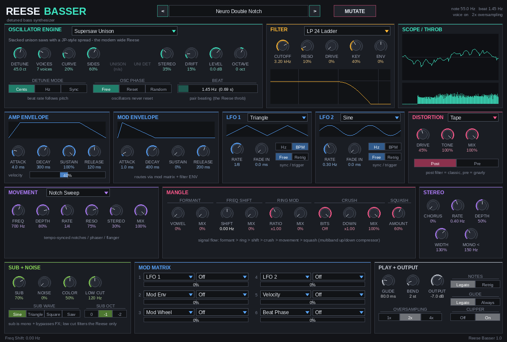

# Reese Basser

A REAPER instrument that only makes **Reese basses**, with eight different ways
of generating one, tempo-lockable beating, and a rack of tools for mangling the result.



It is a single-file **JSFX**, so it runs natively in REAPER on Windows, macOS
and Linux with nothing to compile. You can open it in REAPER's editor and change it.

---

## Install

1. In REAPER: **Options → Show REAPER resource path in explorer/finder**.
2. Copy `ReeseBasser.jsfx` into the `Effects` folder (a sub-folder such as
   `Effects/ReeseBasser/` also works).
3. Restart REAPER (or refresh the FX browser with F5). On a track, add FX →
   **JS: Reese Basser - Reese bass synthesizer**; it is listed under **Instruments**.
4. Arm the track for MIDI input, or draw MIDI items, and play.

Requires **REAPER 6.74 or newer** (the plugin has 100 automatable parameters
and uses slider shaping). REAPER 7 is recommended.

Every control is a normal REAPER parameter, so automation, REAPER's own **Parameter
Modulation** (LFO / audio follower / MIDI link) and **FX Parameter MIDI Learn** work on all of them.

The custom UI scales to any window size. The 100 parameters are hidden from REAPER's
plain slider list (otherwise that list pushes the UI out of the window), but they still
appear by name in automation envelopes, the **Param** button menu, parameter modulation
and MIDI learn.

---

## The idea

A Reese is two or more slightly detuned, harmonically rich oscillators. Their
phases drift in and out of alignment, so the sound throbs ("beats"). Each
harmonic *n* beats at *n × Δf*, which produces the characteristic swirl.
Everything else (filtering, distortion, notch sweeps, width) is shaping.

Reese Basser treats **the beat** as the main control:

| Detune mode | What the DETUNE knob means | Use it for |
|---|---|---|
| **Cents** | Classic detune. Beat rate follows the note, so higher notes throb faster. | The traditional sound, like every synth tutorial |
| **Hz** | The two oscillators are an exact number of Hz apart, so every note throbs at the *same* rate. | Consistent movement across a whole bassline |
| **Sync** | The beat is a tempo division (1/4, 1/8T, 2 bars…). On each new note the oscillators' relative phase is locked to the song position. | Throb that grooves with the drums. Not something normal synths can do |

The **BEAT** meter in the engine panel shows the current beat rate and period,
and the **Beat Phase** modulation source lets you move anything in sync with the
throb (for example cutoff, to exaggerate it).

---

## Engines (the Reese methods)

| # | Engine | Method | A / B / C |
|---|---|---|---|
| 1 | **Dual Saw (Classic)** | Two detuned oscillators, the Saunderson / jungle / DnB standard. Osc 2 can morph saw→square→triangle→sine and be transposed (−24…+24, including the +19 "octave + fifth" layering trick). | Wave 2 / Pitch 2 / Balance |
| 2 | **Supersaw Unison** | 3–16 stacked saws with a JP-style spread curve, the modern unison Reese. | Voices / Curve / Side mix |
| 3 | **PWM** | Pulse width swept at the beat rate. A pulse is a saw minus a shifted saw, so sweeping the width is itself a detune (the TAL/MusicRadar method). Osc 2 adds a quadrature-phased second pulse. | PWM depth / Width / Osc 2 |
| 4 | **Phase Distortion (CZ)** | Casio CZ-style phase distortion with lines 1 + 1′ detuned, the synth family the original 1988 "Just Want Another Chance" bass came from. Waves: Saw, Square, Pulse, Reso Saw/Tri/Trap. | DCW / Wave / Line 1′ |
| 5 | **FM Cross-Mod** | Detuned carriers phase-modulated by a sine, so the timbre sweeps at the beat rate. | Index / Ratio / Feedback |
| 6 | **Hard Sync** | Two detuned master/slave pairs. Aggressive, vocal, neuro. | Sync ratio / Slave wave / Master mix |
| 7 | **Phaser (Filter Reese)** | A single saw through a key-tracked allpass phaser swept at the beat rate: movement from filtering rather than detune. | Depth / Feedback / Stages |
| 8 | **Cross-Fold** | A sine through a wavefolder that is audio-rate modulated by its detuned twin (the Noise Engineering "reese with anything" approach). | Fold / X-mod / Symmetry |

Picking an engine from the UI loads sensible A/B/C starting values. Double-clicking
A, B or C resets it to that engine's default.

Shared oscillator controls: **Unison** (1–8 copies of each oscillator) and
**Uni Det** (their extra detune), **Stereo** spread, **Drift** (slow random
analog pitch wander), **Level** (drives the filter), **Octave**, and **Osc
Phase** (Free, Reset for an identical punch on every note, or Random).

---

## Signal flow

```
 Engine (oversampled 1x/2x/4x) ─┬─ + noise ─ [pre-drive] ─ FILTER ─ [post-drive] ─ decimate
                                │
 VCA (amp env × velocity) ◄─────┘
   └─ MANGLE: formant → ring mod → freq shift → crush
      └─ MOVEMENT: notch sweep | phaser | flanger (tempo synced)
         └─ SQUASH (3-band upward/downward compressor)
            └─ Reese low cut ─ chorus ─ width ─ mono-bass
               └─ + SUB (mono, clean) ─ pan ─ output ─ soft clipper
```

### Filter
LP 24 ladder (zero-delay feedback, saturating, resonance-compensated so the low
end doesn't vanish), LP 12 / band-pass / high-pass / notch state-variable
filter, or Off. **Drive** saturates the filter input. **Key** is key tracking
(higher notes open the filter). **Env** sets how far the mod envelope sweeps the
cutoff. A live response curve is drawn under the knobs.

### Distortion
Tape, Tube (asymmetric), Hard Clip, Wavefold, Rectify, Pedal OD (an
overdrive-pedal circuit, Trace-style techstep). **Tone**, **Mix**, and
**Post/Pre** filter placement. Post is the classic order; Pre lets the filter
carve the distorted harmonics. It runs inside the oversampled section, so
heavy drive aliases much less.

### Movement
Tempo-synced **Notch Sweep** (two notches an octave apart, the neuro standard),
**Phaser** (6 stages with feedback) or **Flanger** (a comb tuned by FREQ). Each has
Depth, Rate, Resonance, Stereo (left/right LFO offset) and Mix.

### Mangle
* **Formant**: morphs through the A-E-I-O-U vowels for talking "yoi" basses. Modulate *Vowel*.
* **Freq Shift**: shifts every harmonic by the same number of Hz, making the sound inharmonic
  and metallic; small shifts at partial mix give a barber-pole phase.
* **Ring Mod**: key-tracked. The ratio is relative to the played note, so integer ratios stay in tune.
* **Crush**: bit depth + sample-rate reduction, for the early-jungle sampled-Reese grit.
* **Squash**: 3-band upward/downward compression that brings up the fizz, like the OTT-style
  processing used on modern Reeses.

### Stereo and low end
Chorus, M/S **Width**, and **Mono <** (everything below that frequency is summed
to mono, 120 Hz by default), so the Reese can be very wide and still mono-compatible.

### Sub + Noise
A clean **sub oscillator** (sine / triangle / square / saw, 0 / −1 / −2 octaves)
that skips every effect and stays mono. **Low Cut** high-passes only the Reese
layer, giving the common split of a clean sub underneath a dirty, wide top.
**Noise** (with colour) adds texture before the filter.

### Modulation
Amp and mod ADSR envelopes, two LFOs (7 shapes, Hz or tempo sync, free or
retrigger, fade-in), plus a **6-slot mod matrix**:

* Sources: LFO 1, LFO 2, Mod Env, Amp Env, Velocity, Mod Wheel, Aftertouch, Key Track, Note Random, **Beat Phase**.
* Destinations: Cutoff, Resonance, Detune, Pitch, Engine A/B/C, Filter Drive, Dist Drive, Move Freq, Move Mix,
  Vowel, Freq Shift, Ring Ratio, Crush, Unison Spread, Stereo Spread, Width, Volume, Pan, Sub Level, Noise Level,
  LFO 1 Rate, LFO 2 Rate.

### Playing
Monophonic with a last-note-priority note stack: hold a note, play another, release, and it returns.
**Legato** (envelopes don't retrigger on overlapping notes) or **Retrig**.
**Glide** applies on legato notes only or always. Also pitch bend range,
velocity sensitivity, sustain pedal, and all-notes-off handling.

---

## Presets

Pick one from the preset box at the top (◀ ▶ step through them).

1. **Init – Classic Dual Saw**
2. **Saunderson '88 (CZ)**: dark, phase-distortion original
3. **Terrorist Jungle**: sampled-and-crushed jungle Reese with sub
4. **Mutant Techstep**: pedal-overdriven, notch-swept (Trace / Ed Rush era)
5. **Neuro Double Notch**: supersaw, sweeping notches, squash
6. **Liquid Roller**: saw + square an octave down, soft LFO filter
7. **Garage PWM**
8. **FM Growl**
9. **Sync Scream**
10. **Filter-Method Reese** (phaser engine)
11. **Cross-Fold Mod**: try the mod wheel
12. **Yoi Talker**: formant LFO
13. **Tempo-Locked Throb**: beat synced to 1/8 notes, cutoff following Beat Phase
14. **Barberpole Shift**
15. **Bitcrushed Sampler**
16. **Burial Rumble**
17. **Wide Unison Wall**
18. **Hoover Reese**
19. **Ring-Mod Metal**
20. **Talking Flanger**

**MUTATE** randomises the engine, the mangle and movement sections, the
modulation, or everything, within musical ranges. **Nudge** makes small
random changes to the current sound. Mutating from a preset you like is a
quick way to find variations. Your own sounds save with the project, and
REAPER's preset menu (the "+" button in the FX window) can store them as user presets.

---

## UI tips

* **Drag** a knob up/down. **Shift+drag** for fine adjustment.
* **Double-click** or **Ctrl/Cmd+click** resets to the default.
* **Mouse wheel** steps a knob or cycles a dropdown.
* The footer shows the full name and value of whatever is under the mouse.
* **Oversampling** (bottom right): 1x is lightest on CPU, 2x (default) is the
  best balance, 4x is cleanest for heavy distortion and sync.

## Reese recipes (from the guides)

* **Classic**: Dual Saw, 20–50 cents, LP 24 at 200–700 Hz, a little resonance, glide ~100 ms, legato.
* **Rumble that stays mono-safe**: Sub at −1 octave, Low Cut ~100–150 Hz, Mono < 120 Hz, then add Width / Chorus freely.
* **More animation**: Key Track up and transpose the last notes of a phrase an octave up. Or LFO → Cutoff at 1/8, with Fade In so only long notes wobble.
* **Neuro**: Supersaw or Sync → Distortion (post) → Notch Sweep → Squash. Automate Move Freq.
* **Perfect-fifth layer**: Dual Saw, Pitch 2 = +19 st, Balance ~30 %.
* **Resampled jungle**: Crush 8–12 bits with Downsample 2–4. Add Drift for tape wobble.

---

## Development / tests

The plugin was developed with an offline harness in `tools/`:

* `tools/jsfx2c/jsfx2c.py`: a small JSFX/EEL2 → C transpiler that follows the JSFX programming
  reference: case-insensitive names, equal-precedence `&&`/`||`, define-before-use functions,
  documented built-in argument counts, bounds-checked memory, and errors for case-only name clashes.
* `tools/jsfx2c/runtime.c`: renders audio from MIDI event lists and logs `@gfx` drawing.
  `render_gfx.py` turns that log into a PNG.
* `tools/test_render.py`: renders every engine at every oversampling rate, all mangle/FX blocks
  and all presets. It checks for NaN, silence and clipping, and **measures the beat rate** to
  verify the Cents / Hz / Tempo-Sync detune modes.
* `tools/make_demo.py`: renders all presets on a DnB bassline to `build/demo/`.

Project notes for contributors (and AI assistants): `CLAUDE.md`, `docs/JSFX_NOTES.md`
(verified JSFX facts), `docs/DECISIONS.md` (architecture decision records) and
`docs/SESSION_LOG.md`.

```
pip install numpy          # (lameenc optional, for the MP3 demo)
python3 tools/test_render.py
python3 tools/make_demo.py
```

Sources that informed the design: Kevin Saunderson's 1988 CZ patch, the Renegade/Ray Keith
"Terrorist" resampling, Trace's Boss SD-1 techstep Reese, and tutorials from Sample Market
(keytracking, synced filter mod, sub split, +19 layer), LANDR (mono legato, saw + square,
chorus, centred lows), MusicRadar (PWM Reese), Native Instruments (notch sweeps, ±0.3 st
detune), Noise Masters (sub + noise layers), RouteNote (notch + multiband), Mind Flux, and
Noise Engineering (audio-rate modulated processors).

## License

MIT, see [LICENSE](LICENSE).
